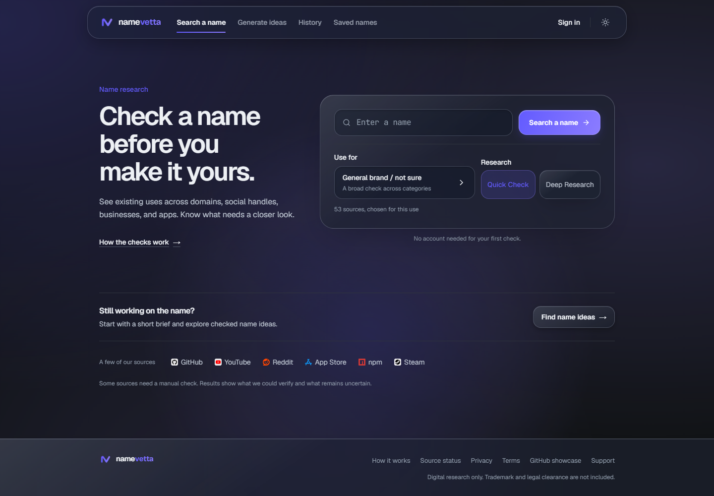
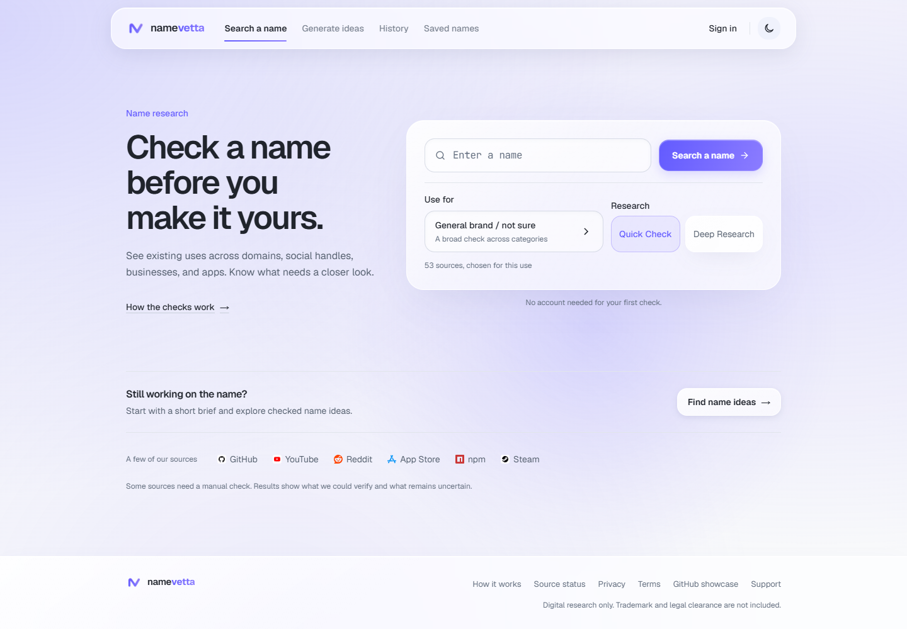
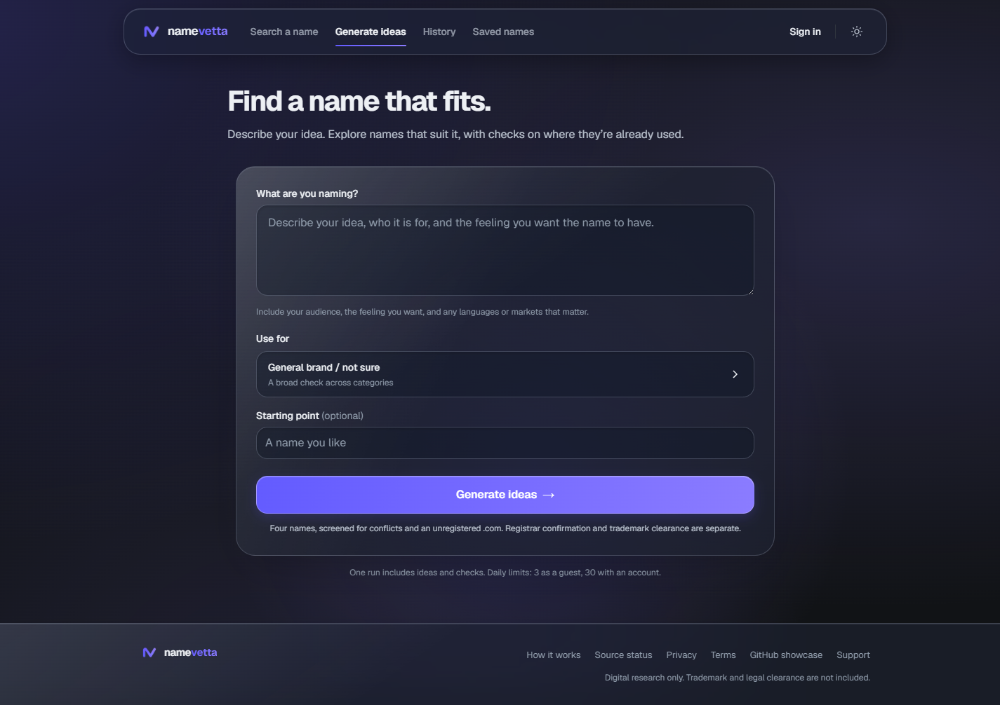
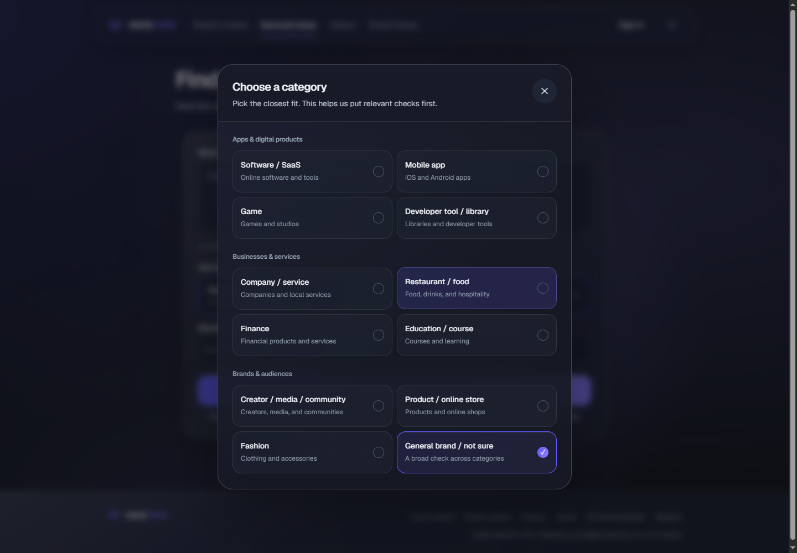
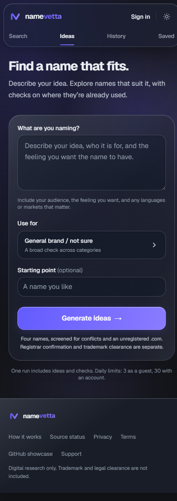

<p align="center"></p>
<h1 align="center">NameVetta</h1>
<p align="center">Research a name before you build on it.</p>
<p align="center">
  <a href="https://namevetta.vercel.app">Try the app</a> ·
  <a href="#run-locally">Run locally</a> ·
  <a href="CONTRIBUTING.md">Contribute</a>
</p>
<p align="center">
  <a href="https://github.com/Gr33nOps/namevetta/actions/workflows/ci.yml"></a>
  <a href="LICENSE"></a>
</p>



NameVetta is an open-source name research app. Check an existing name across domains, code registries, app stores, businesses, and social platforms, or describe your idea to generate a screened shortlist.

## What you can do

- **Research a name:** run a Quick Check or Deep Research and inspect the evidence behind each finding.
- **Generate four names:** describe your audience and idea freely. AI proposes and reviews candidates, followed by actual registration and conflict checks. A completed run returns exactly four checked names; incomplete runs offer a retry without adding unchecked names.
- **Understand the result:** name viability and research coverage are separate. A failed source is never treated as clear.
- **Keep your research:** optional Google/email sign-in, saved names, history, and shared reports.
- **Use it on any screen:** light and dark themes, glass surfaces, responsive layouts, and reduced-motion support.

## Product preview

| Light theme | Name generation |
| --- | --- |
|  |  |

<details>
<summary>Categories and mobile</summary>


<p align="center"></p>

</details>

Screenshots from the live app, September 2026.

## Run locally

Requires Node.js 22 and npm.

```sh
git clone https://github.com/Gr33nOps/namevetta.git
cd namevetta
npm ci
cp .env.example .env.local
npm run dev
```

On PowerShell, use `Copy-Item .env.example .env.local` for the copy step. Open [localhost:3000](http://localhost:3000).

The app builds without credentials. Public source checks work without AI; account features need Supabase, and name generation needs an AI provider. Add only the integrations you want to use in `.env.local`:

| Integration | Configuration |
| --- | --- |
| Primary AI | `GEMINI_API_KEY`, with `GEMINI_MODEL=gemini-3.8-flash` |
| Backup AI | `GROQ_API_KEY`, using `qwen/qwen3.8-27b` |
| Accounts and persistence | Supabase URL, anon key, service-role key, and guest hash salt from `.env.example` |
| Deep web research | Optional Tavily key |
| Other integrations | See the comments in `.env.example` |

For Supabase, apply the SQL files in [supabase/migrations](supabase/migrations) in filename order to your own project. Enable the sign-in providers you need and configure the Auth callback URL for your local or deployed app at `/auth/callback`. Keep service-role and AI keys server-side.

## Development checks

```sh
npm run typecheck
npm run lint
npm test
npm run build
npx playwright install chromium
npm run test:e2e
```

GitHub Actions runs the unit and benchmark suite, type checks, lint, dependency audit, production build, and browser tests. Live-provider tests are opt-in because they consume quota and depend on external services. The normal test suite needs no credentials.

## How it works

Next.js and React handle the interface. TypeScript source adapters turn external responses into consistent evidence, which feeds deterministic scoring and coverage calculations. Gemini creates and reviews name candidates, with Groq as fallback. AI does not decide whether a domain is registered or replace the evidence-based score.

- [Architecture](docs/ARCHITECTURE.md)
- [Naming and screening pipeline](docs/NAMING_GENERATION.md)
- [Database schema](docs/SCHEMA.md)
- [Copy guidelines](docs/COPY_STYLE.md)
- [Contributing](CONTRIBUTING.md)
- [Security reporting](SECURITY.md)

Deploy your own copy to Vercel using the standard Next.js build and your own environment variables. Other Node.js hosting can use `npm run build` followed by `npm start`.

## What a check means

“No registration found” describes the RDAP response at the time of the check. It does not guarantee a domain purchase, trademark clearance, or unrestricted use of a name. Failed and manual-only checks remain visible as gaps in coverage. Review the evidence before making a naming decision.

## License

[MIT](LICENSE). You can use, modify, and self-host the code. The license does not grant trademark rights or imply endorsement by NameVetta.
