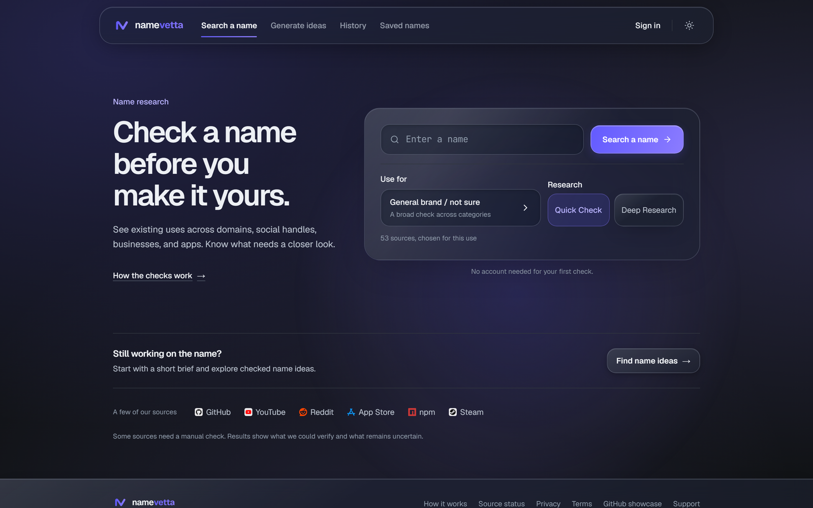
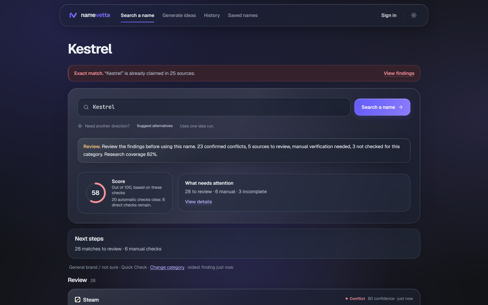
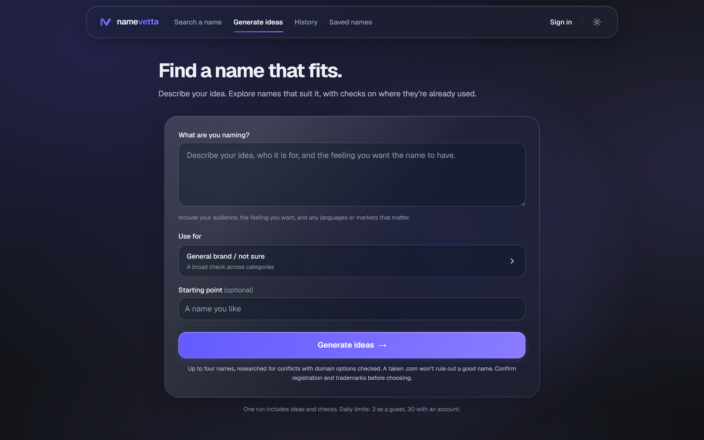
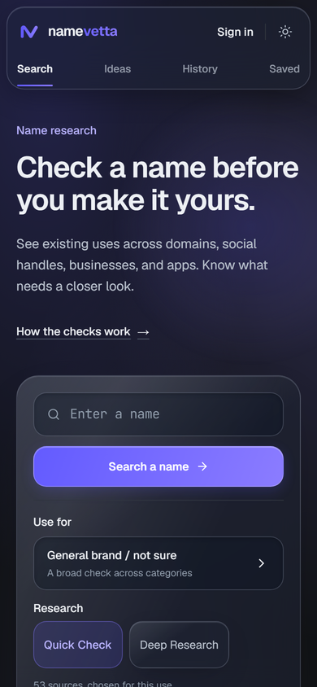
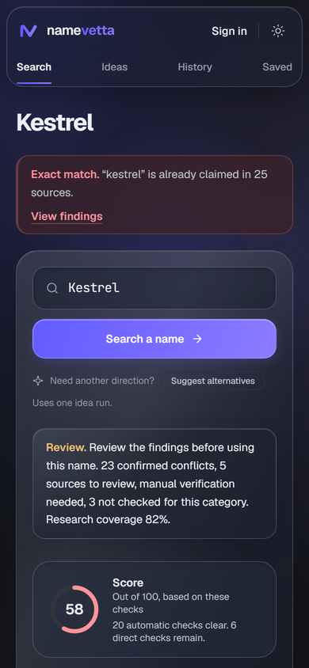

<div align="center">


# NameVetta

**Check a name before you make it yours.**

Domains, package registries, app stores, social handles, companies and the open web,
checked in one search. Every finding comes with its evidence.

[**Try it live**](https://namevetta.vercel.app) ·
[Methodology](https://namevetta.vercel.app/methodology) ·
[Source status](https://namevetta.vercel.app/status) ·
[Architecture](docs/ARCHITECTURE.md)


<br />



</div>

<br />

## What it does

Type a name and pick what it's for. NameVetta runs the checks that make sense for that
use (a general check covers 53 sources) and returns a report that says what it found,
what it couldn't verify, and what you still need to look at yourself.

It does **not** do trademark or legal clearance. That limit is stated on the home page,
on every report, and pinned by a test.

## Showcase

<table>
  <tr>
    <td width="58%" valign="top">
      
      <sub><b>A report.</b> The verdict first, then the score, then every finding with its source.</sub>
    </td>
    <td width="42%" valign="top">
      
      <sub><b>Name ideas.</b> Describe the idea; each suggestion is checked before you see it.</sub>
    </td>
  </tr>
</table>

<table>
  <tr>
    <td width="50%" align="center" valign="top">
      <br />
      <sub>Phone: home</sub>
    </td>
    <td width="50%" align="center" valign="top">
      <br />
      <sub>Phone: report</sub>
    </td>
  </tr>
</table>

<sub>Screenshots are from the [live site](https://namevetta.vercel.app) in its dark theme. There's a light theme too.</sub>

## What it checks

| Where | What's looked up |
|---|---|
| **Domains** | 37 TLDs over RDAP with a DNS fallback, plus common lookalike swaps (`rn`/`m`, `0`/`o`, `1`/`l`) on a Deep Research |
| **Code and packages** | GitHub, npm, PyPI, crates.io, RubyGems, NuGet, Docker Hub, Homebrew, Packagist, Hex, CRAN, Maven Central, pub.dev, CocoaPods, Anaconda, Hackage, Deno, CPAN, Terraform, Snap Store, Go Modules, Chocolatey, Flathub, F-Droid |
| **Extensions and plugins** | VS Code Marketplace, Firefox Add-ons, WordPress Plugins |
| **Apps and games** | App Store, Google Play, Steam, itch.io |
| **Creative and social** | YouTube, Bluesky, Dribbble, Behance, Vimeo, SoundCloud, Flickr, DailyMotion, Patreon, Gravatar, Codeberg, Hacker News, Bitbucket, Linktree, About.me, X |
| **Companies and registries** | SEC EDGAR, Companies House (UK), the French company register, GLEIF (global LEI), Wikidata, OpenStreetMap for local businesses |
| **The open web** | A web search on Deep Research, cached for 30 days |
| **Manual only** | Instagram, TikTok, Threads, Slack and a few more, with a direct link and instructions |

Nothing here scrapes. When a source can't be automated legitimately and for free, the
report gives you a manual step instead of a guess.

A source stays automatic only while it can answer the question it claims to. Slack was
probed at `{name}.slack.com` until measurement showed every real workspace answers 403
with a browser-not-supported page. That's a block, not a verdict, so Slack is manual now.
CPAN's web page returns 200 for modules nobody has published, so it reported a conflict
on every name until it was switched to the MetaCPAN API. Both are covered in
[`reliability.test.ts`](src/lib/sources/reliability.test.ts).

## How results are read

There is no `available` status anywhere in the system. Availability is a claim the
sources rarely let us make, so every check ends in one of five states:

| Status | Meaning |
|---|---|
| `no_conflict` | The search finished and found nothing meaningful |
| `similar_found` | Worth investigating |
| `confirmed_conflict` | Exact or very strong match |
| `unable_to_verify` | The source failed, was rate-limited, or is unsupported |
| `manual_check_recommended` | Automatic evidence isn't reliable enough |

A source that couldn't be checked is left out of the score, not counted as clean. The gap
shows up as lower **Research Coverage**, which sits next to the score and is never blended
into it. A score of 90 with 40% coverage reads as "looks fine, but we only checked part."

That rule is enforced in four places so it can't erode: Zod schema invariants, Postgres
`CHECK` constraints, scoring (unverifiable sources contribute `null`, not `0`), and
presentation (unverified states render neutral grey with a `?`, never green or amber).

The **Digital Viability Score** is weighted by what you're naming. A crowded npm
namespace matters a lot for a developer tool and barely at all for a restaurant.
Duplicate matches count once, extra findings add diminishing risk, and one reliable
conflict can't be averaged away by clear results from the same source group. If two names produce the same evidence they get the same score; the app
doesn't invent small differences to make the numbers look varied.

**Similarity** is deterministic: Unicode normalization and homoglyph folding, consonant
skeletons, Levenshtein, Damerau-Levenshtein, Jaro-Winkler, n-gram cosine, and Double
Metaphone. A 40-node industry taxonomy ranks an exact match in an unrelated field below a
near match in the same one.

**Trademark Assist** doesn't search trademark registries. It prepares you to: spelling,
confusable and phonetic variants, likely Nice classes with reasoning, and searchable
goods and services wording, then links to USPTO, TMview and WIPO with instructions.

## The code

```text
src/
  app/                 Next.js App Router pages and API routes
  components/          UI
  lib/
    sources/           one adapter per source, plus exact-probe, rate limits, health
    orchestrator/      runs the source manifest for a name and a category
    scoring/           viability score, confidence ceilings, conflict caps
    similarity/        string and phonetic matching
    generator/         name generation, screening, shortlist, dedupe
    providers/         LLM providers (Gemini, Groq) with fallback
    trademark/         Trademark Assist
    db/                Supabase access
e2e/                   Playwright specs
supabase/migrations/   schema and RLS
docs/                  architecture, schema, roadmap, copy style
```

Next.js 16 (App Router), React 19, strict TypeScript, Tailwind v4, Supabase (Postgres,
Auth, RLS), Zod at every boundary, Vitest and Playwright. It runs on free tiers.

### Run it locally

```bash
npm install
cp .env.example .env.local
npm run dev
```

Every credential is optional. With none set the app still researches names, and sources
that need a key report `unable_to_verify` so coverage drops accordingly. [`.env.example`](.env.example)
lists what each key unlocks.

```bash
npm test            # unit and integration tests, plus the golden benchmark
npm run bench       # the golden quality benchmark on its own
npm run test:e2e    # Playwright against a real browser (sources are stubbed)
npm run typecheck
npm run lint
npm run check-sources   # hit each live endpoint once and check its response shape
npm run security        # free security scanners in one pass
```

The end-to-end suite never calls a real source, so it can't spend quota or hammer an
upstream. `check-sources` runs on its own daily schedule in GitHub Actions, separate from
the checks that gate pull requests, because a live check is flakier than a mocked one.

### Docs

- [Architecture](docs/ARCHITECTURE.md): source model, orchestration, scoring, source policy
- [Schema](docs/SCHEMA.md): database tables and RLS
- [Roadmap](docs/ROADMAP.md): what's built and what deliberately isn't
- [Naming generation](docs/NAMING_GENERATION.md): how ideas are proposed, filtered and ranked
- [Copy style](docs/COPY_STYLE.md): the standard for every line of user-facing text

## Trust details

- **[/methodology](https://namevetta.vercel.app/methodology)** generates the status table,
  score weights and per-source confidence ceilings from the manifest that runs at request
  time, so it can't describe a rule the product doesn't enforce.
- **[/status](https://namevetta.vercel.app/status)** publishes each source's real success
  rate over the last 24 hours.
- **Per-source retry.** A source that failed for a transient reason can be retried on its
  own without spending a new check, capped per report.
- **Liveness on npm and GitHub.** An exact match is checked against real activity
  (downloads, publish date, repos, followers), so a package abandoned in 2016 doesn't score
  like one with 600M downloads.
- **Every new source is probed before it ships.** A registry is only added once a
  known-taken name and a known-free name get different answers from it. Instagram, X,
  TikTok and Threads return `200 OK` for handles that don't exist, so none is checked by
  status. `exact-probe.ts` carries that rule and a test pins it: an unexpected 403, 429
  or 500 resolves to `unable_to_verify`, never to a clean result.
- **Accessibility is tested.** Skip link on every page, named landmarks, a real radio
  group for research depth, and table semantics on the comparison grid, all asserted in
  Playwright.

## Status

Live: the research engine, similarity and industry relevance, scoring with conflict caps,
Trademark Assist, Compare Names, the name generator, accounts with history, saved names
and share links, daily quotas, AI explanations on Deep Research (grounded against the
report's own evidence), a 116-case quality benchmark that gates CI, security headers,
Terms and Privacy, account export and deletion, cross-instance cache and health
persistence, share-link Open Graph images, and a printable report.

Not built yet: scoring refinement beyond the caps already in place, and scans that
survive navigating away.

## License

The code is released under the [MIT License](LICENSE). The NameVetta name and logo
aren't covered by it, so please don't ship a fork under the same name or mark.

Names and logos of the services NameVetta checks belong to their owners, and this project
isn't affiliated with any of them. NameVetta is research tooling, not legal advice.
