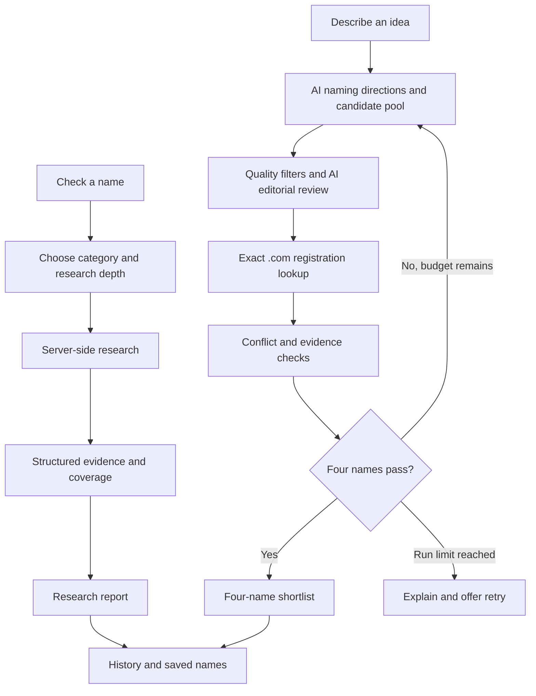

# Product architecture

This repository describes NameVetta's public product flow. Application source, credentials, scoring weights, and operational configuration remain private.

Generation and verification are separate. AI proposes and edits names based on the brief; registration lookups and research sources supply availability evidence. Replacement rounds exclude candidates already rejected by the checks. Runs are bounded and never fill missing slots with unverified names.

The interface shows real screening progress, supports cancelling a run, and retains the brief when the user returns to edit it. Successful generation returns four names, each with its research score, coverage, and checked `.com`.

Reports distinguish verified observations, discovery evidence, manual checks, and missing evidence. A failed or skipped lookup is not a clear result. Domain registration status does not establish trademark clearance or guarantee a domain can be purchased.

The live [source status](https://namevetta.vercel.app/status) page shows the current public catalog and source modes.
